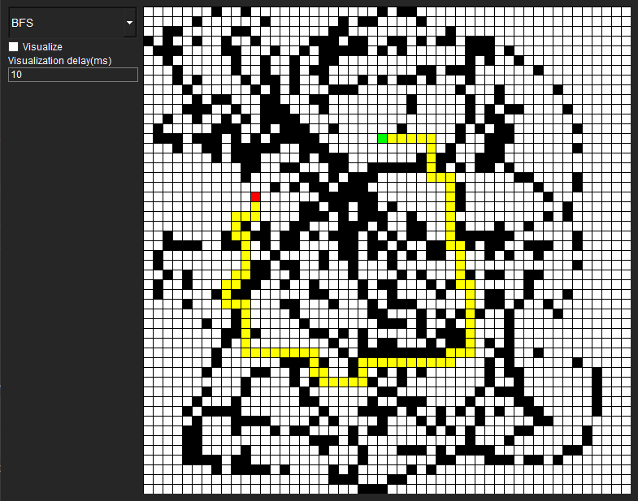

# PathFinding

Pathfinding is a program that visualizes pathfinding.

# Example

Supports pathfinding such as:
* BFS
* DFS(In the future)
* Dijkstra's algorithm(In the future)
* A\* algorithm(In the future)

# Control
Mouse:
* LBM - Paint the cell black
* RBM - Paint the cell white

Keyboard:
* S-Set the starting point of the path
* E-Put the end point of the path
* C-Clear the entire field
* X-Fill in the entire field in black

# TODO
* Make visualization of search algorithms step by step
* Add more pathfinding algorithms